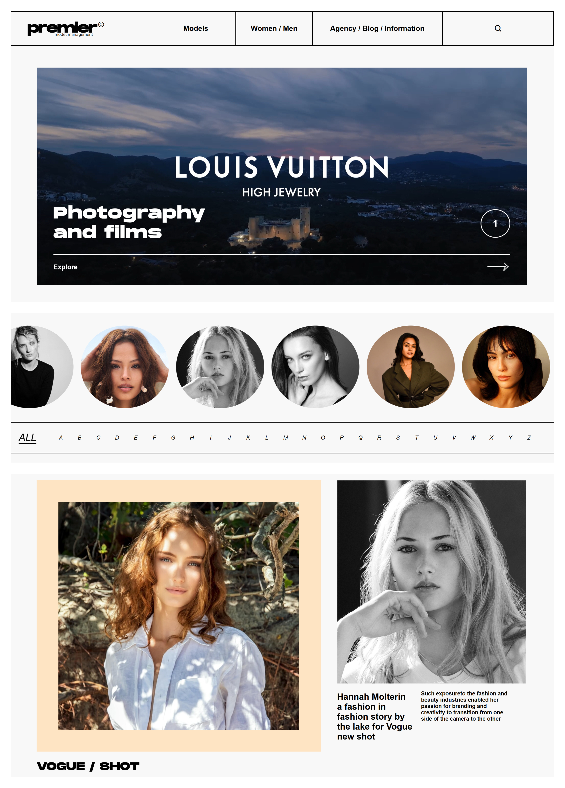
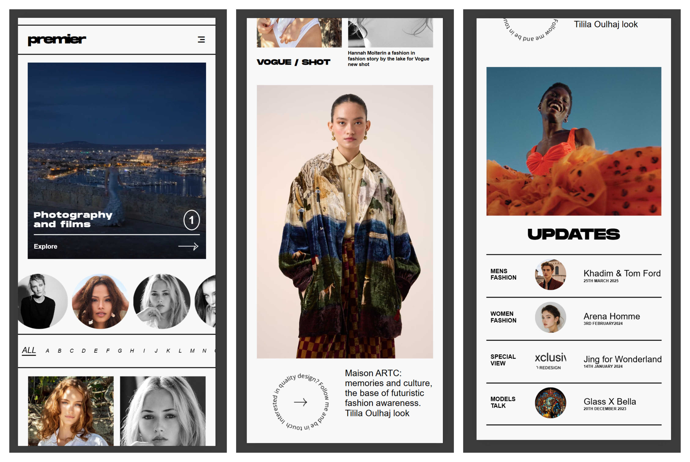
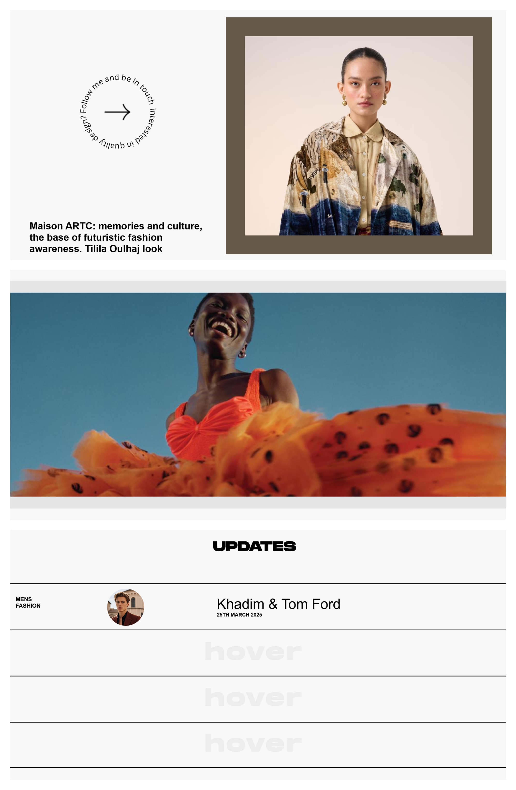
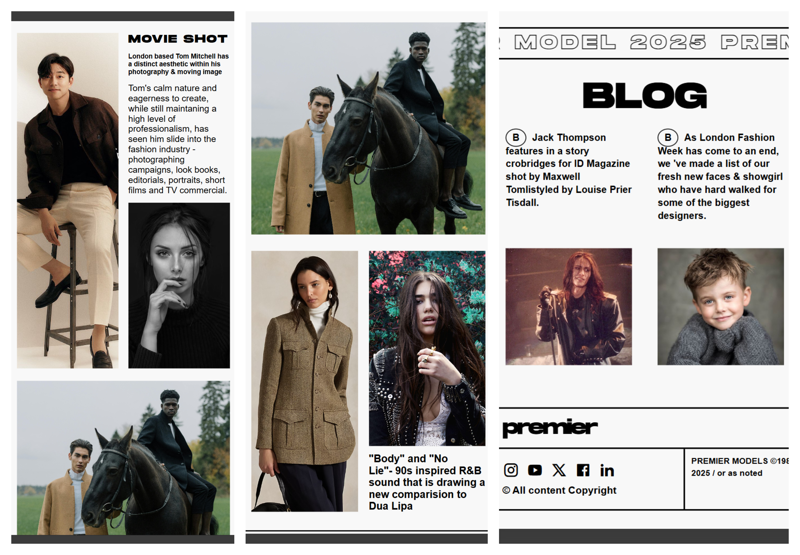
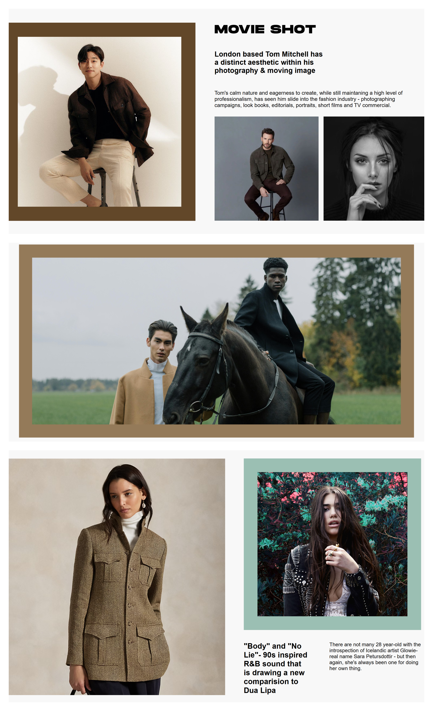
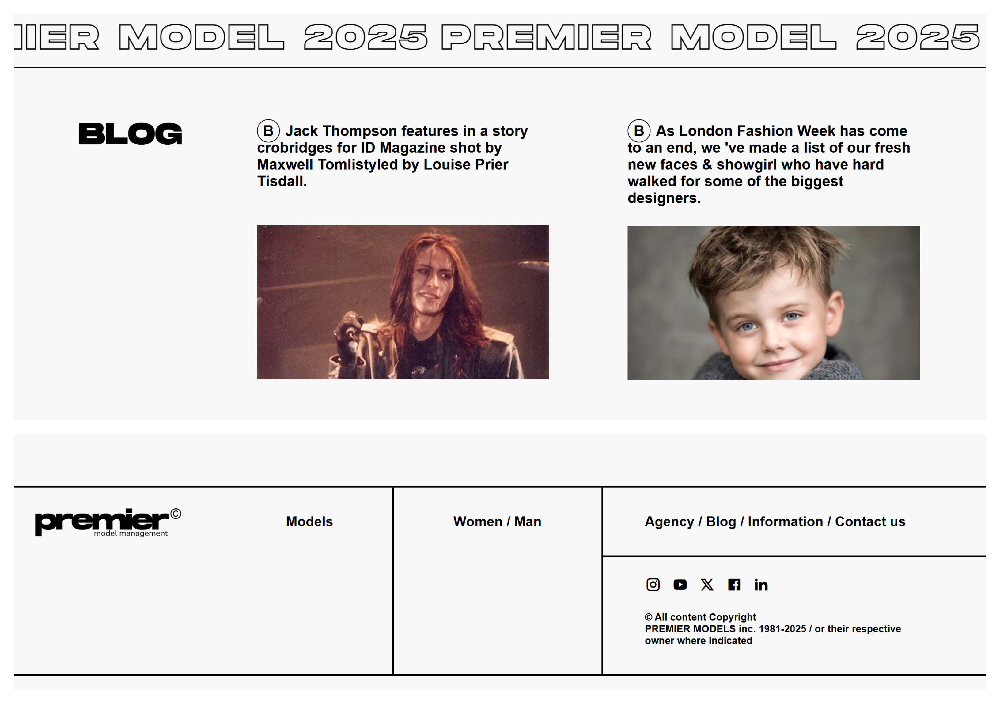

# Premier Model (Old Version) – Responsive HTML & CSS Clone

This is a **fully responsive** clone of the *old version* of the Premier Model Management website. Built using only **HTML and CSS**, this project is part of my web development practice and focuses on creating clean, responsive layouts without any frameworks or JavaScript.

> ⚠️ Note: The current Premier website has changed. This clone is based on their **previous design**.

---

## 🔥 Features

- Fully responsive for **laptop and mobile** views
- Clean and minimal **HTML/CSS structure**
- **Font embedding** using `@font-face`
- Custom animations and hover effects
- No JavaScript or external frameworks used

---

## ⚠️ Responsiveness Note

- ✅ Perfectly responsive on **laptop and mobile**
- ⚠️ **Tablet view is not fully optimized** (will be improved in future)

---

## 📁 Folder Structure

project-folder/
│
├── assets/
│ ├── fonts/
│ ├── images/
│ └── videos/
├── index.html
└── style.css

---

## 🚀 Live Demo

> https://vadik-x.github.io/Premier-model-clone/

---

## 📸 Screenshots

| Laptop View                                        | Mobile View |
|----------------------------------------------------|--------------------------------------------------
   |  
   |  
   |
   |

---

## 🎬 Screen Recording

[Click to watch the full demo](https://drive.google.com/file/d/1nnYd3RwWl730Tl5Xdl84q1Q7BfsJ83x6/view?usp=drive_link)  

---

## 📌 Why This Project?

I created this clone to:
- Practice responsive web design from scratch
- Improve CSS layout skills (flexbox, grid, positioning)
- Learn how to organize files in a real-world HTML/CSS project

---

## 🧠 What I Learned

- How to build a full landing page using just HTML/CSS
- Embedding custom fonts with `@font-face`
- Designing clean UI layout without JS
- Handling responsiveness using media queries

---

## 👨‍💻 Author

**Vadik Malik**  
Built with ❤️ for practice and portfolio.

---

## 📝 License

This project is for educational and personal portfolio use only. Not intended for commercial use.